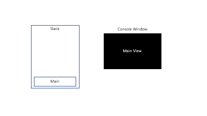

# StorageTransWord

# 📕단어 번역 프로그램

---

- 해당 프로젝트는, 파파고 api를 단어를 번역하는 프로그램 입니다.
- http 클라이언트 라이브러리를 이용하여 파파고의 restapi에 접속하여 단어 데이터를 전송
- 번역된 단어를 db에 저장하여 보관하는 프로세스입니다.
- 콘솔 출력 화면 처리용 객체를 생성후 스택에 저장하여 뒤로가기 기능을 구현하였습니다.



# Requirements

---

- **rust lang**
- **sqlite**
- ****
- **파파고 api 설정 파일(**[https://developers.naver.com/docs/papago/papago-nmt-overview.md](https://developers.naver.com/docs/papago/papago-nmt-overview.md))
    
    ```json
    //driver_config.json
    {
    	"client_id":"애플리케이션 등록 시 발급받은 클라이언트 아이디 값",
    	"client_secret":"애플리케이션 등록 시 발급받은 클라이언트 시크릿 값"
    }
    ```
    

# Compile

---

```bash
cargo run
```
